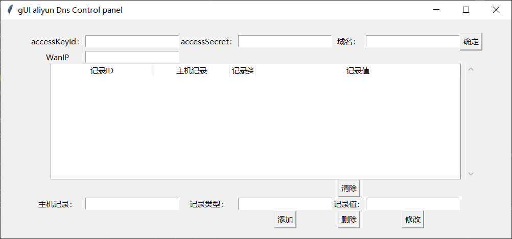
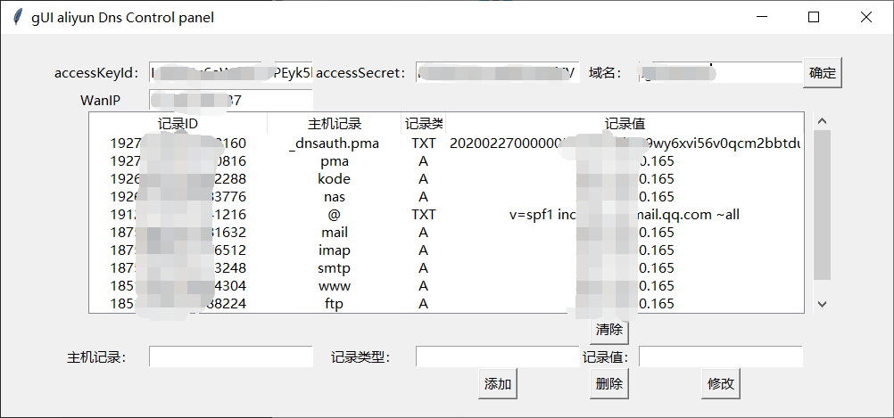

# GUI-aliyun-Dns-Control-panel

dns阿里云解析api+python3开发的域名解析记录管理工具

>本工具基于阿里云API开放接口
>>另有精简工具可用于阿里云解析的动态域名解析，详情见 https://github.com/tutdahai/aliDDns

## 功能简介

1.accessKeyId 阿里云APIkeyID

2.accessSecret 阿里云API密钥

>获取方式参考 https://help.aliyun.com/knowledge_detail/94557.html

3.domain 绑定在阿里云解析的域名

4.填写过得accessKeyId、accessSecret及域名自动保存到account.json文件中，下次使用可自动填写

5.wanip 本机公网ip地址

6.支持选中自动填写进行修改，清除按钮可清空已填写内容

7.支持云解析记录的添加、删除、修改功能

## 默认打开界面

## DNS解析记录

